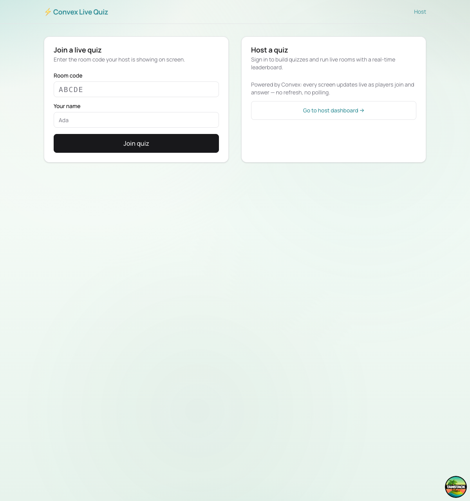
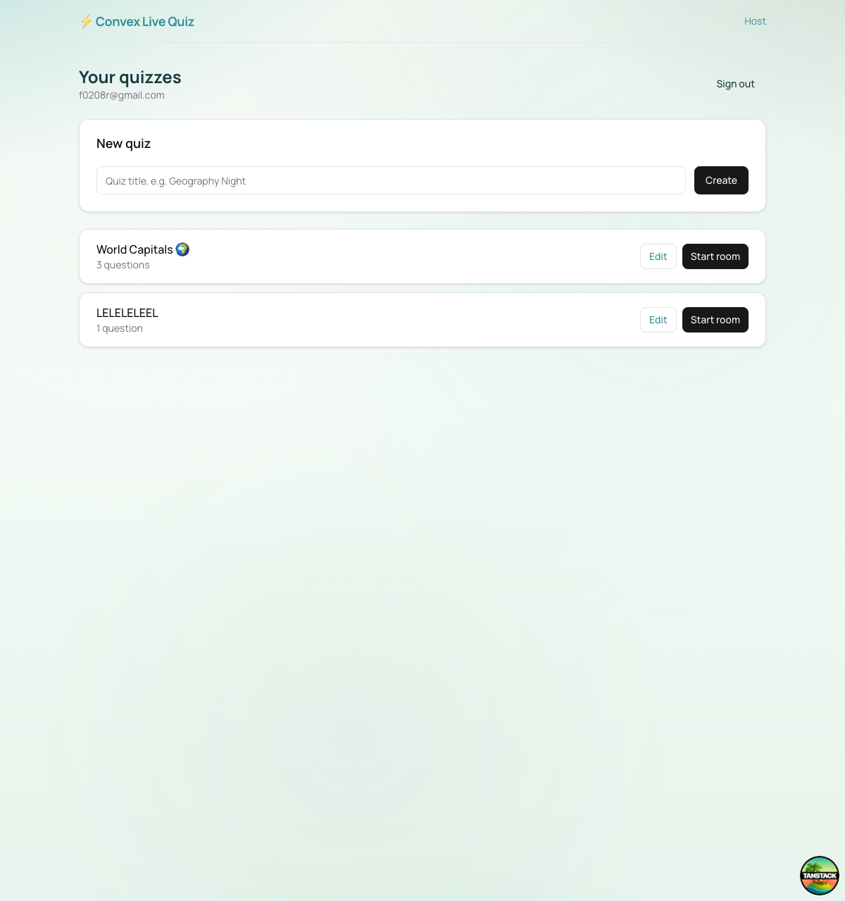
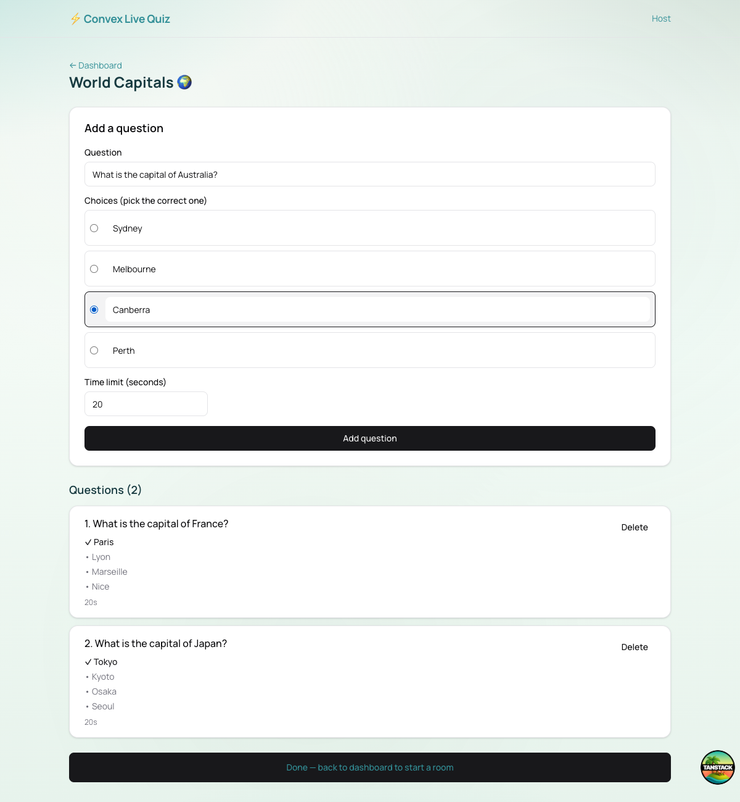
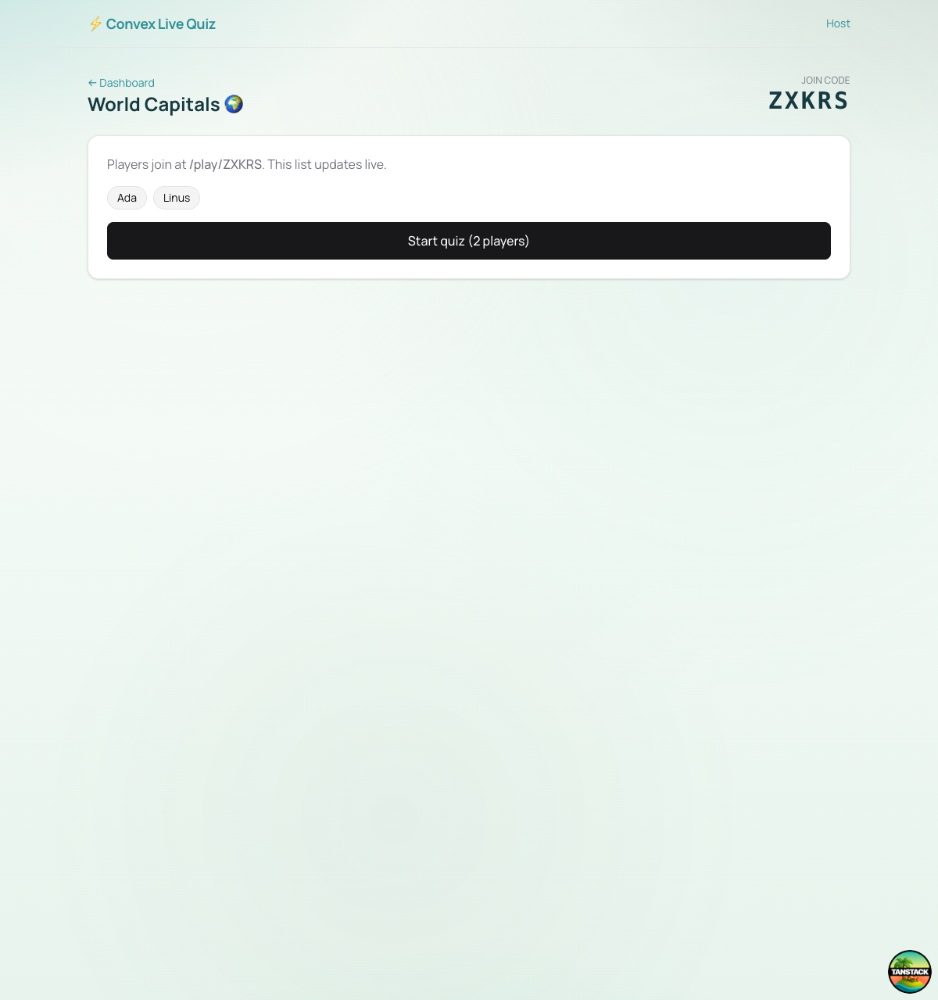
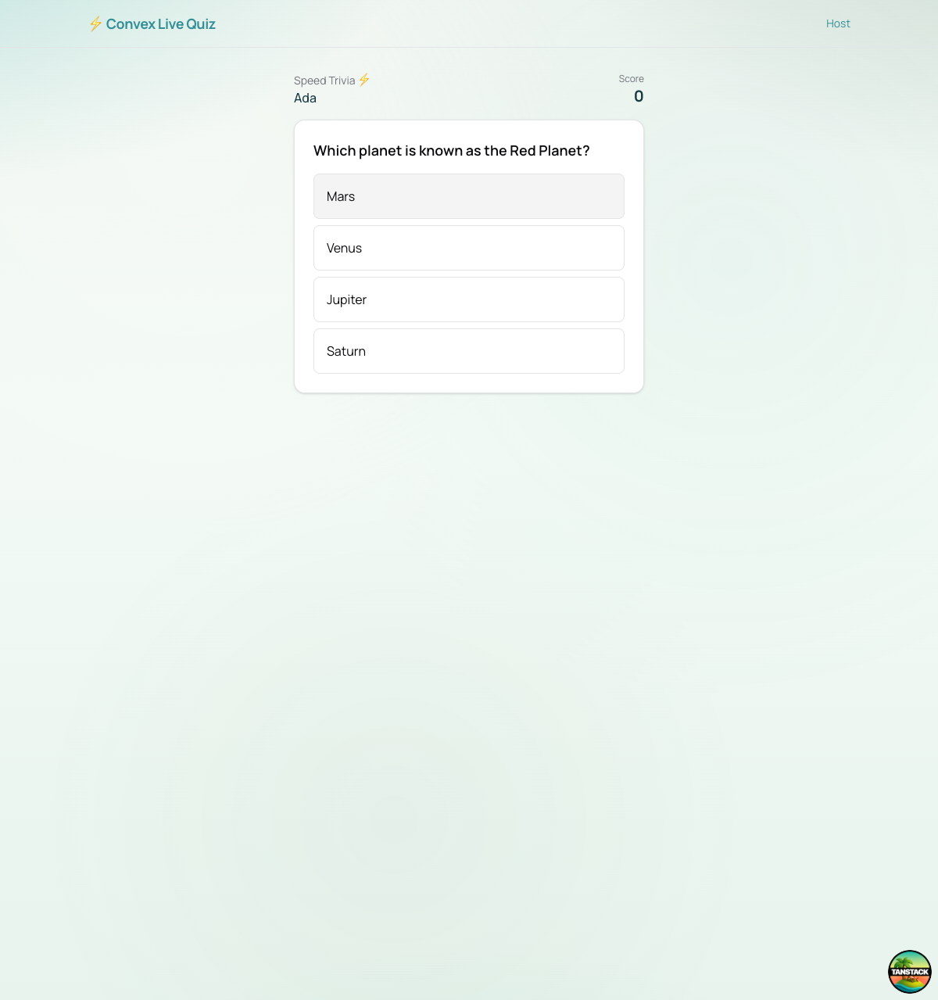
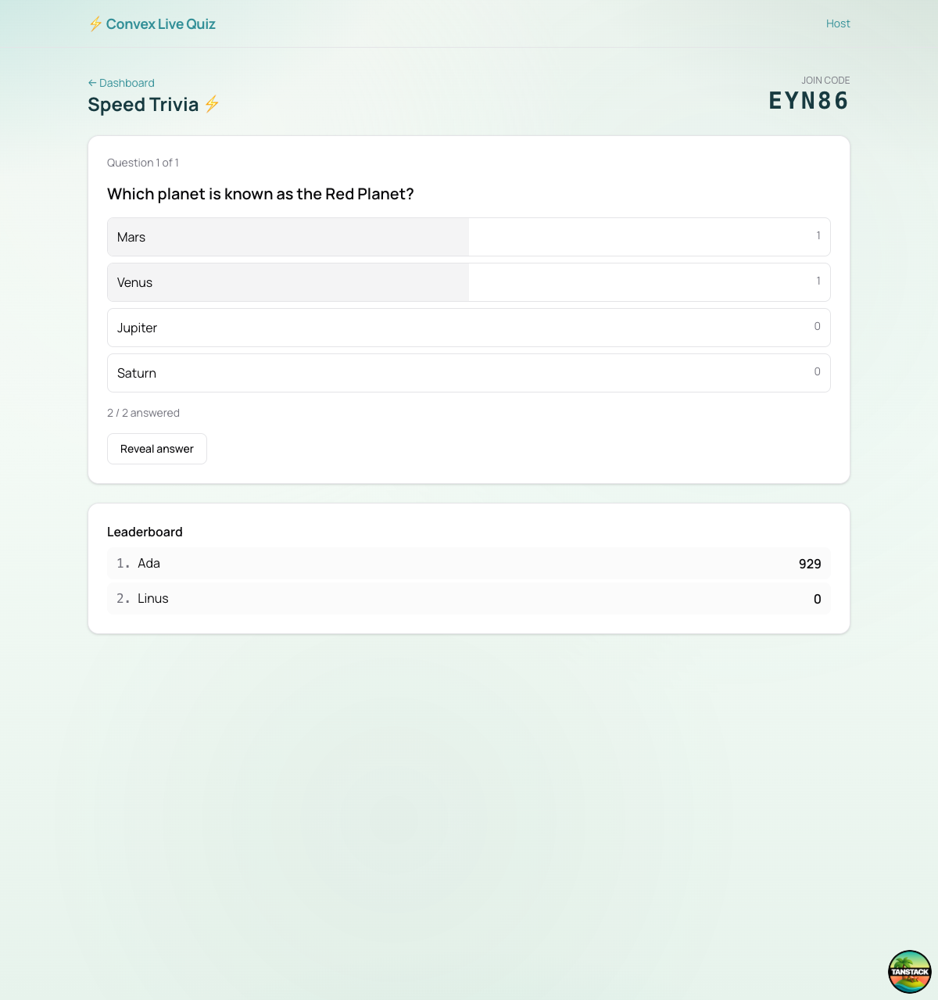
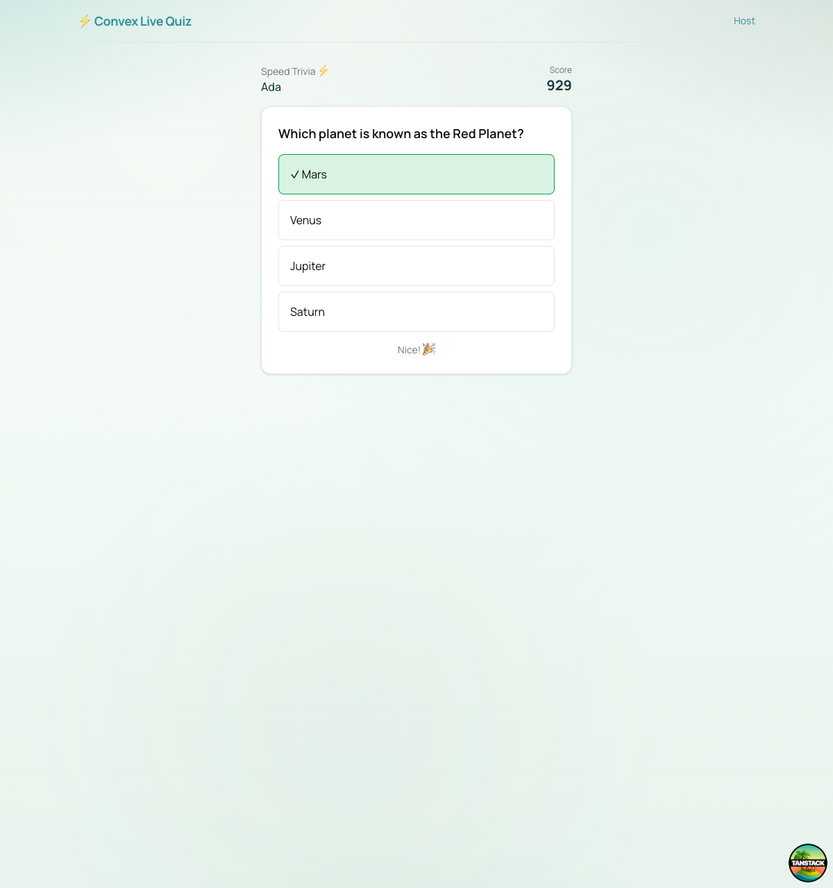
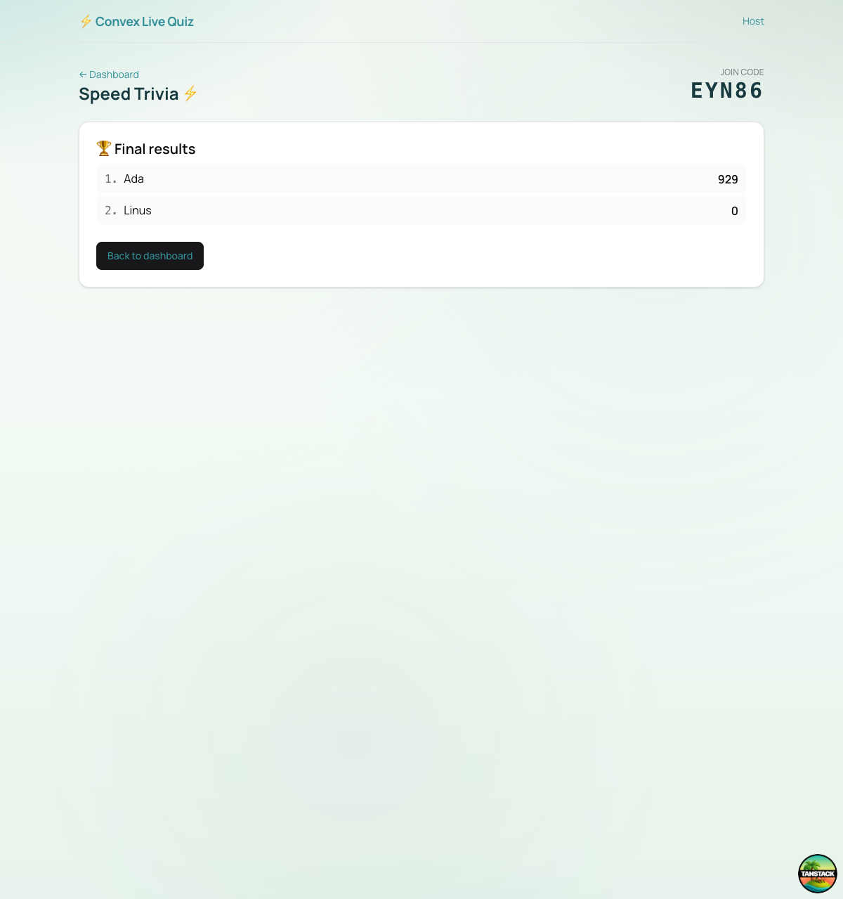

<div align="center">

# ⚡ Convex Live Quiz

**A real-time, multiplayer quiz game — built to show off what [Convex](https://convex.dev) does best.**

Host a quiz, share a join code, and watch players, answers, and the leaderboard
update **live** on every screen — no refresh, no polling, no websocket plumbing.

[Features](#-what-it-shows-off) · [Screenshots](#-screenshots) · [How it works](#-how-it-works) · [Run it](#-run-it-locally) · [Tech](#-tech-stack)

</div>

---

## ✨ What it shows off

This isn't a generic CRUD demo — every feature was chosen to highlight a Convex superpower:

| Convex feature | Where it's used |
| --- | --- |
| 🔄 **Reactive queries** | The lobby, per-answer result bars, and leaderboard update instantly for every connected client as data changes. |
| ⏱️ **Scheduled functions** | When a question starts, `ctx.scheduler.runAfter` schedules an automatic "reveal" once the timer runs out. |
| 🔁 **Cron jobs** | An hourly cron cleans up abandoned rooms. |
| 🧮 **Transactional mutations** | Answer recording + speed-based scoring happen atomically, with a guard against double-answering. |
| 🔐 **Convex Auth** | Password sign-in for hosts; players join rooms as guests with an unguessable per-player token. |

## 📸 Screenshots

### Landing — join a game or host one


### Host: build a quiz
The host creates a quiz and adds questions, choices, the correct answer, and a per-question timer.

| Dashboard | Question editor |
| --- | --- |
|  |  |

### Live lobby — players appear in real time
Players join at `/play/<CODE>` and show up on the host's screen instantly.



### Gameplay — answer, reveal, score
| Player answering | Host live results | Player reveal |
| --- | --- | --- |
|  |  |  |

The host sees answer tallies climb live (`2 / 2 answered`) and the leaderboard reorder as scores land — **faster correct answers score more**.

### 🏆 Final leaderboard


## 🎮 How it works

1. A **host** signs in and builds a **quiz** (questions + choices + per-question timer).
2. The host opens a **room**, which gets a short **join code**.
3. **Players** go to `/play/<CODE>`, pick a name, and join — appearing live in the host's lobby.
4. The host starts the quiz. Players answer; results and the leaderboard update in real time. Each question **auto-advances to "reveal"** when its timer expires (a scheduled function), or the host can reveal early.

## 🧱 Tech stack

- **[Convex](https://convex.dev)** — reactive database + serverless functions (queries, mutations, scheduled functions, crons)
- **[Convex Auth](https://labs.convex.dev/auth)** — password authentication
- **[TanStack Start](https://tanstack.com/start)** (React 19) — full-stack framework, file-based routing
- **[Tailwind CSS](https://tailwindcss.com)** + shadcn-style components
- **[Bun](https://bun.sh)** — package manager & runtime

## 🚀 Run it locally

Requires [Bun](https://bun.sh) and a (free) [Convex](https://convex.dev) account.

```bash
bun install

# 1. Create the Convex project & push the backend (opens a browser to log in,
#    prompts to create a project, writes CONVEX_DEPLOYMENT + VITE_CONVEX_URL to .env.local)
bunx convex dev --once

# 2. Configure Convex Auth env vars (JWT keys, SITE_URL) on the deployment
bunx @convex-dev/auth

# 3. Run the backend watcher + frontend together
bunx convex dev      # terminal 1 — pushes function changes live
bun run dev          # terminal 2 — http://localhost:3000
```

Then open `http://localhost:3000`, sign in as a host, build a quiz, start a room,
and join from other browser tabs/devices at `/play/<CODE>`.

> 💡 Prefer zero setup? `bunx convex dev` can spin up a **local** deployment without a Convex account.

## 🗂️ Project layout

```
convex/
  schema.ts      # quizzes, questions, rooms, participants, answers (+ Convex Auth tables)
  auth.ts        # Convex Auth — Password provider
  http.ts        # auth HTTP routes
  quizzes.ts     # quiz authoring (auth-gated)
  rooms.ts       # live game logic + scheduled reveal + cron cleanup
  users.ts       # currentUser query
  crons.ts       # hourly stale-room cleanup
src/
  routes/        # TanStack Start file-based routes
    index.tsx              # landing (join / host)
    login.tsx              # host sign in / sign up
    host.tsx               # auth gate (layout)
    host.index.tsx         # host dashboard
    host.quiz.$quizId.tsx  # quiz editor
    host.room.$roomId.tsx  # host live control panel
    play.$code.tsx         # player screen
  components/ui/  # shadcn-style primitives (Button, Card, Input, Label)
  integrations/convex/provider.tsx  # ConvexAuthProvider
```

---

<div align="center">
<sub>Built as a demo of Convex's real-time primitives. Not affiliated with Convex.</sub>
</div>
